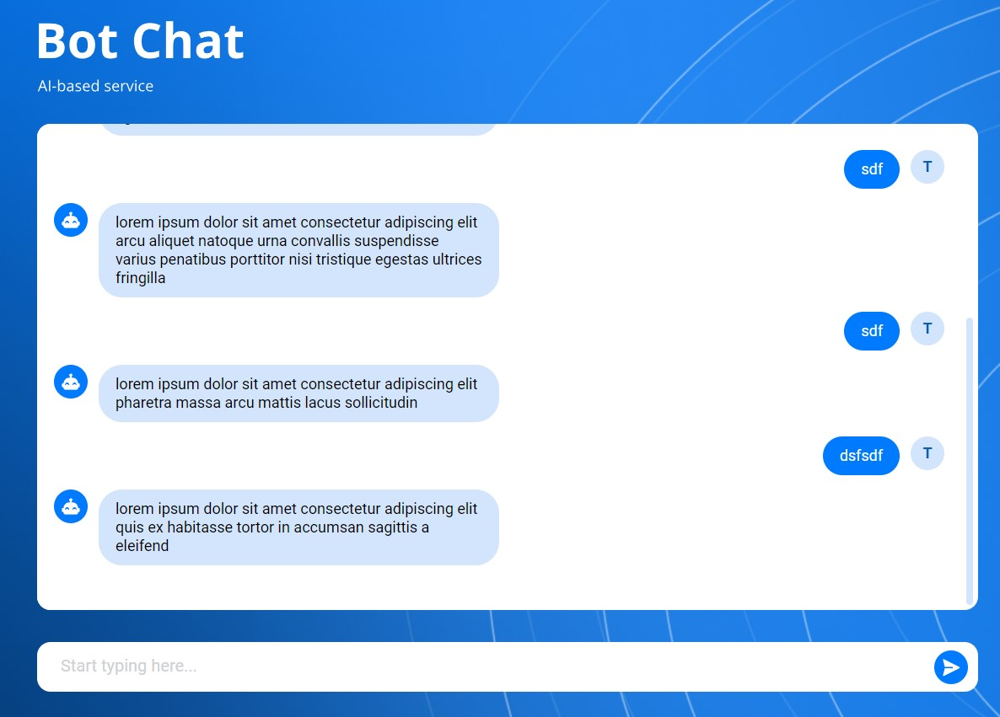

# React + Typescript + Vite

## Description

Hasboon AI Based chat project

## Launch

There is 2 options to launch this project:  
**(Make sure you navigated to project folder after cloning it)**

- With basic launch command:  `npm install && npm run dev command` 
  <u>App will be available on port 5173</u>

- With docker command *(Make sure you have docker installed)*:  `docker-compose up --build` 
<u>App will be available on port 5111</u>

## Usage

This app is integrated with API, which generates the dummy text as a response.

